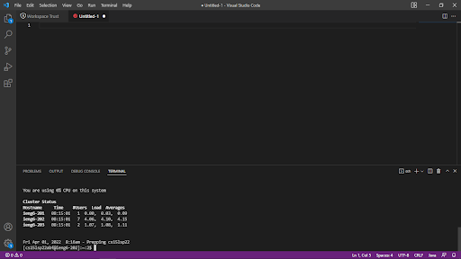
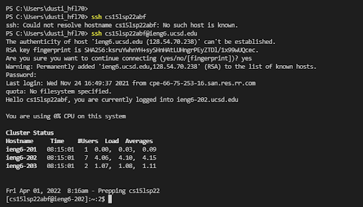
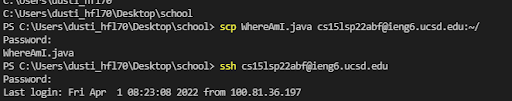
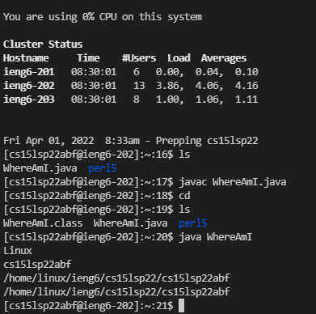
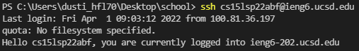
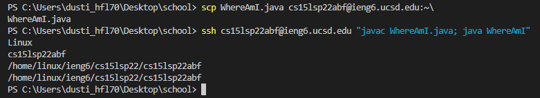

# Lab Report 1 Week 2
 Install VSCODE. It should look similar to this. It's very handy, and we will be using the lower terminal to write out commands.

<br><br><br>


Use the command "ssh" plus your personal account name to log remotely thru the ieng6 server. I logged in remotely by typing in the command 
``` ssh cs15lsp22abf@ieng6.ucsd.edu ```, but your output may look different.

<br><br><br>


You can copy your files from **locally** to the **server**. Type "scp" plus the file you want to send over (In this case WhereAmI.java), and finish off with your username + :~/ 
at the end. It should look like ```scp WhereAmI.java cs15lsp22abf@ieng6.ucsd.edu:~/```

<br><br><br>


Log in with your ssh + username, and then see if you can find the file with ``ls``. Once you've found it, compile it, and look at the difference in your machine and the school's machine!

<br><br><br>


You can skip writing the password by making some rss keys. 
Just showing that I logged in with ssh without the use of a password and private keys. Very handy!

<br><br><br>


You can also save time by pressing up or down on your arrow pad to go back to previous commands. Pressing up will go back up to your last written command, and pressing down will go back to your more recent command.
