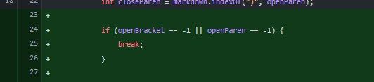
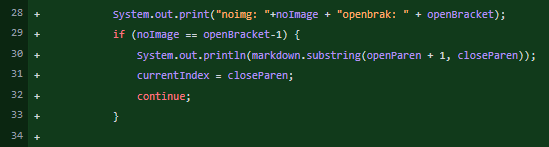
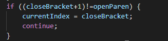

# Lab report 2 week 2 
Note: I didn't do lab 2 all that well and was a little confused with how to format the commits. Going forward this will be much better I assure you.
    

[File used](https://github.com/ddn005UCSD/markdown-parser/commit/aed3a7cb9fc443c4d40ba10a1c61f816d831ffbb)

If a file is not ended by a link, it will continuously loop forever. However, it can be fixed by finding when

    

[File used](https://github.com/ddn005UCSD/markdown-parser/commit/aed3a7cb9fc443c4d40ba10a1c61f816d831ffbb)

Inputs were various wrong formatted and broken link markdowns. If it was a image, it would be added to the list instead of being skipped. The bug that fixed this was skipping to the next first open bracket if a "!" preceeds a "[".

[File used](https://github.com/ddn005UCSD/markdown-parser/commit/aed3a7cb9fc443c4d40ba10a1c61f816d831ffbb)

Any closed bracket that isnt preceded immediatley by an open paranthesis will count whatever is in the next open paranthesis. If there is text inbetween it will count it. Adding the check to see if the "]" is followed immediatley by a "(" will fix it.