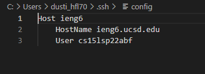
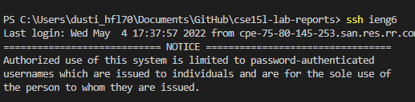
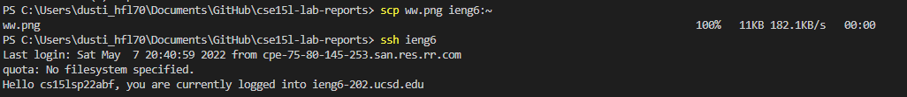
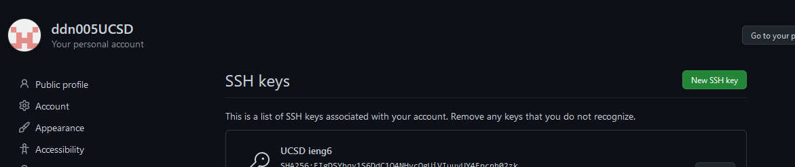
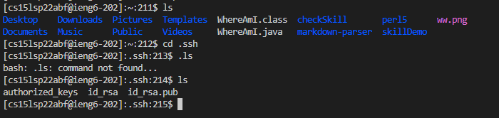
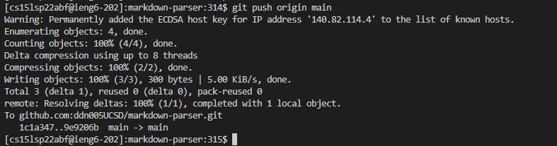
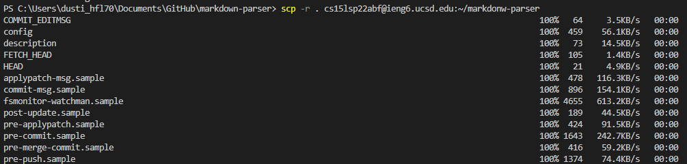
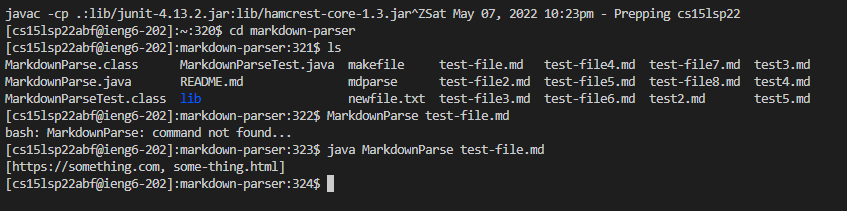
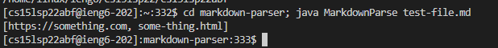

# Lab Report 3 Week 6

## Streamlining ssh configuration  
Showing ssh config

Logging in with the quick username

Copying files with my quick username 

## Setup Github Access from remote    

The ssh key on my github

ssh key location

pushing the commit by remote

[Link to commit smile](https://github.com/ddn005UCSD/markdown-parser/commit/9e9206bc2e0cf62ea2cc7fd208cfe64574ec5242)

## Copy whole directories with scp -r 
Copying the directory from here to there (local to remote)

Running the markdown thru remote

Doing a multi-line command (Was a little hard to run here to there)

