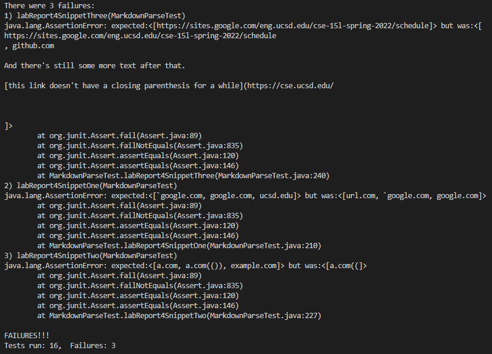
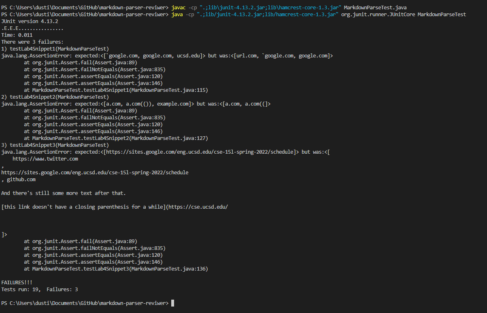

# Lab Report 4 Week 8

[## My repository: ](https://github.com/ddn005UCSD/markdown-parser)  
Did not pass all snippets.

Changes that would make snippet 1 succeed would be to add a check for any blocks of text with ` in it. To get the url with another closed bracket, you can put another if statement within the check to see if the closed bracket is next to the open bracket.
 

For snippet 2, I think it would be good to have another integer to check for the next open bracket, and check if it is hidden behind a closed bracket. 

 

There might be a more involved change for snippet 3, as the extra spaced lines add in the spaces in the markdown parser. So instead of reading the file as one big string, maybe it'd be best to read it as multiple strings instead.

[## Reviewed repository ](https://github.com/nidhidhamnani/markdown-parser)

Did not pass all snippets.
