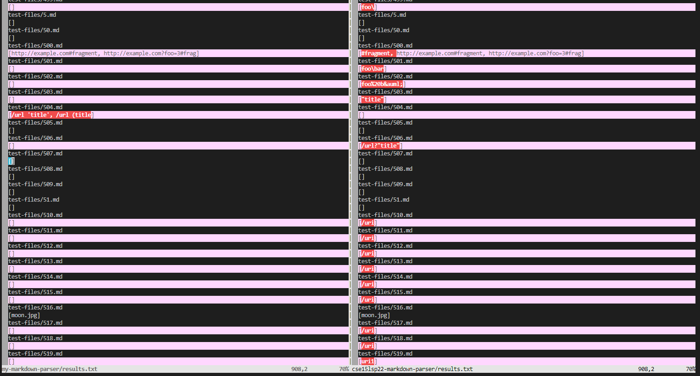
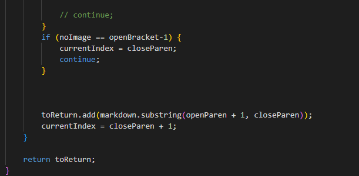

# Lab Report 5 Week 10 

Using VIMDIFF, I looked through to find the differences between my parser and the given parser. 

This is one of the files that produces different answers. 
[(Test 495)](https://github.com/nidhidhamnani/markdown-parser/blob/main/test-files/495.md) 

This is another file.
[(Test 494)](https://github.com/nidhidhamnani/markdown-parser/blob/main/test-files/494.md)

Both files should produce some sort of link, and the parser should return the link within the file. File 495 should return `foo(and(bar))`, and file 494 `\(foo\)`.

Both tests fail for my implementation, and succeed for the given implementation. Here is where the change would need to be made.

The problem for my implementation is that I know it has to do with my implementation of checking if theres no image. This makes it so that all the first links of the file will be skipped if on the first line. I would have to make a specific case to not skip the first line while checking for the image. 